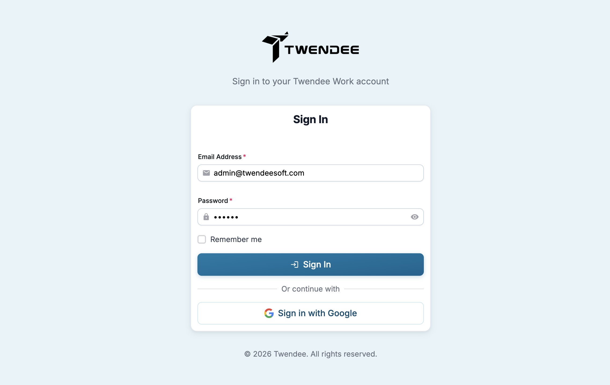

# Getting Started

## 1. Log in

Agentee uses **Single Sign-On (SSO)** through your ERP login portal. There is no separate Agentee account to create — sign in with your existing ERP credentials and you'll be routed into the Agentee chat.

<figure><figcaption></figcaption></figure>


Because access is tied to your ERP identity, the roles and data scoping defined in the ERP apply automatically in Agentee. See [Roles & Permissions](../admin/roles-and-permissions.md).


## 2. Send your first message

Type what you want in plain language — no need to remember function names:

> For example: Show me 10 newest leads

<figure><figcaption></figcaption></figure>

Agentee will respond with a structured answer and, where an action is involved, ask you to review before anything is committed.
